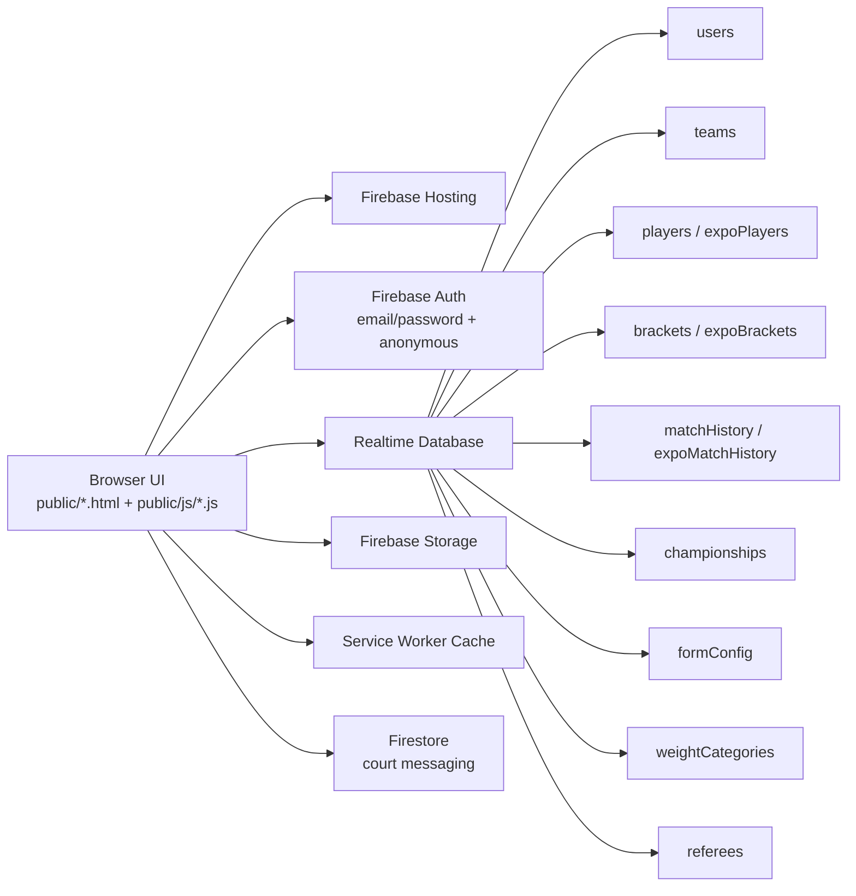

# TKD Championship Manager

<p align="center">
  <a href="https://taekowndo-championship.web.app"></a>
  
  
  
  
</p>

Production URL: https://taekowndo-championship.web.app

This is a complete championship operations platform built for Taekwondo events. It manages team onboarding, player registration (Official and Expo divisions), auto-categorization, dual bracket lifecycles (Official single-elimination + Expo single-match), court-based live match tracking, referee coordination with real-time court messaging, standings, and championship archival. Features 4-role authentication (Admin, Judge, Team, Referee), browser history protection for public users, comprehensive form management, and Excel export tooling throughout.

## Table of Contents

- [1. Project Summary](#1-project-summary)
- [2. Core Features](#2-core-features)
- [3. Role Access Matrix](#3-role-access-matrix)
- [4. Architecture](#4-architecture)
- [5. Page Map](#5-page-map)
- [6. Repository Structure](#6-repository-structure)
- [7. Client Module Map](#7-client-module-map)
- [8. Firebase Configuration](#8-firebase-configuration)
- [9. Realtime Database Model](#9-realtime-database-model)
- [10. Local Development Setup](#10-local-development-setup)
- [11. First-Time Bootstrapping](#11-first-time-bootstrapping)
- [12. Operational Workflows](#12-operational-workflows)
- [13. Deployment](#13-deployment)
- [14. Browser History Protection](#14-browser-history-protection)
- [15. Image Optimization](#15-image-optimization)
- [16. Performance Notes](#16-performance-notes)
- [17. Security Notes](#17-security-notes)
- [18. Troubleshooting](#18-troubleshooting)
- [19. Bracket Export Tools](#19-bracket-export-tools)
- [20. Roadmap Ideas](#20-roadmap-ideas)
- [21. Recent Updates (May 2026)](#21-recent-updates-may-2026)
- [22. Recent Updates (July 2026)](#22-recent-updates-july-2026)
- [23. Credits](#23-credits)

> **Latest updates:** Expo Competition System, Live Matches redesign, referee auth fixes, Excel export tooling — Jul 21 2026

## 1. Project Summary

TKD Championship Manager is a Firebase-hosted web app for managing tournament operations from registration to final standings.

Primary capabilities:

- Multi-role login and authorization (admin, judge, team, referee)
- Dynamic registration form configured by admin, with per-player Official/Expo/Official & Expo division selection
- Automatic age and weight category derivation
- Official bracket: single-elimination generation, round progression, bye/walkover handling, bronze-medal semi-final logic
- Expo bracket: independent single-match competition system (no rounds, no bronze — winner gets Gold, runner-up Silver)
- Court-based live match tracking across both divisions, with real-time court-to-court pairing of the live and up-next match
- Referee coordination: dedicated login/dashboard, assigned court, real-time messaging with admin
- PDF and Excel export from bracket workflows, team dashboards, and championship statistics
- Team-level registration deadlines and lock controls
- Championship history archive and restore

## 2. Core Features

| Area | What it does |
| --- | --- |
| Authentication | Admin/Judge use Firebase Auth email-password. Team uses username-password against `teams` node. Referee uses a referee-ID/password login that also signs in anonymously to Firebase Auth (see [Section 17](#17-security-notes)) so RTDB/Firestore rules can resolve their role. All roles session-protected. |
| Public Registration | Public users can register players with image upload/capture, form validation, phone number, and Official/Expo/Official & Expo division selection. |
| Browser History Protection | Public users are prevented from accessing login pages via browser back button navigation. Four-layer protection system ensures security. |
| Registration | Team registers players with image upload/capture and form validation. Phone number required for all players. |
| Category Logic | Age category derives from DOB. Weight category derives from gender + age category + weight. |
| Official Brackets | Create and manage rounds, match outcomes, bye/walkover handling, bronze medal (semi-final losers), and progression. |
| Expo Brackets | Independent parallel competition system — flat match list (no rounds), single match per player, automatic Gold for an unpaired (odd-count) player. |
| Live Match Ops | Live Matches board merges Official + Expo matches, grouped and paired by court, with clear division badges (🏆 Official / 🎯 Expo) and a "To Be Decided" state when no court is active. |
| Referee Operations | Referees log in to a dedicated dashboard, are assigned a fixed court (pre-selected automatically when starting a match), and exchange real-time messages with admin per-court or broadcast. |
| Standings | Championship standings and medal-oriented tracking. |
| Admin Tools | Team creation, form editor, weight category editor, referee management, championship management, championship statistics with Excel export. |
| Export | PDF fixtures (landscape A3) and Excel fixture/results sheets from bracket workflows (Official + Expo); Excel exports of player roster/results from the Team Dashboard; Excel export of full team-wise/category-wise player statistics from the Admin Dashboard. |
| Caching | Service worker plus runtime cache strategies for faster repeat loads. |

## 3. Role Access Matrix

| Role | Main capabilities |
| --- | --- |
| Admin | Full control: teams, form config, weight categories, referee management, championship lifecycle, bracket operations (Official + Expo), archive/restore, statistics export. |
| Judge | Match handling and bracket progression actions (as allowed by pages and rules). |
| Team | Login with team credentials, register/edit players (Official/Expo/Both), manage own team workflow and filters, export roster/results to Excel. |
| Referee | Login with referee ID, assigned to a fixed court, run Official/Expo matches from the shared bracket page, view the Live Matches board, message admin in real time. |

## 4. Architecture



## 5. Page Map

| Route | Purpose |
| --- | --- |
| `/index.html` | Entry login page for Admin/Judge and Team tabs |
| `/admin-login.html` | Dedicated admin login (email/password) |
| `/coach-login.html` | Dedicated team/coach login |
| `/referee-login.html` | Referee login (ID/password + anonymous Firebase Auth sign-in) |
| `/player-register.html` | Public player registration form (no authentication required) |
| `/thank-you.html` | Post-registration success page with history protection and close functionality |
| `/leaderboard.html` | Public leaderboard view |
| `/register.html` | Team player registration/edit form |
| `/admin/dashboard.html` | Main admin control center — team management, championship statistics (with Excel export), navigation hub |
| `/admin/bracket.html` | Tournament bracket operations — Official and Expo tabs, shared by admin/judge/referee roles |
| `/admin/Live-matches.html` | Court-based Live/Up-Next match board — merges Official + Expo, division badges, real-time sync |
| `/admin/form-preview.html` | Team-facing form preview |
| `/admin/weight-categories.html` | Weight category management |
| `/admin/championships.html` | Championship CRUD manager |
| `/admin/standings.html` | Standings manager |
| `/admin/referees.html` | Referee account management (create/edit referees, assign court numbers) |
| `/admin/edit-form.html` | Registration form field editor |
| `/team/dashboard.html` | Team roster dashboard — medal filter, age-category filter, search, Excel export of player info and results |
| `/referee/dashboard.html` | Referee-specific dashboard — assigned court, nav to Bracket/Live Matches, court messaging inbox |

## 6. Repository Structure

```text
.
├── .firebaserc
├── firebase.json
├── firebase-rules.json
├── PERFORMANCE_OPTIMIZATIONS.md
├── DEPLOYMENT_REFERENCE.md
├── CHANGES_SUMMARY.md
├── COMPREHENSIVE_AUDIT_REPORT.md
├── IMPLEMENTATION_GUIDE.md
├── DOCUMENTATION_INDEX.md
├── START_HERE.md
├── README.md
├── TKD_Bracket_Template.xlsx       # Pre-generated blank 16-player bracket template
├── generate_bracket_template.py    # Python script to regenerate the Excel template
├── functions/                      # currently empty
└── public/
    ├── index.html
    ├── player-register.html        # Public registration form
    ├── thank-you.html              # Post-registration success page
    ├── leaderboard.html            # Public leaderboard
    ├── register.html
    ├── admin/
    │   ├── dashboard.html
    │   ├── bracket.html             # Official + Expo tabs
    │   ├── championships.html
    │   ├── form-preview.html
    │   ├── Live-matches.html        # Court-based Official+Expo live board
    │   ├── standings.html
    │   ├── weight-categories.html
    │   ├── referees.html            # Referee account + court management
    │   └── edit-form.html
    ├── team/
    │   └── dashboard.html           # Roster + Excel export (player info/results)
    ├── referee/
    │   └── dashboard.html
    ├── coach-login.html
    ├── admin-login.html
    ├── referee-login.html
    ├── assets/
    │   ├── css/main.css
    │   └── images/
    └── js/
        ├── firebase.js
        ├── auth.js
        ├── ui.js
        ├── modal.js
        ├── registration.js
        ├── public-registration.js   # Public form submission handler
        ├── bracket.js               # Official bracket engine
        ├── expoBracket.js           # Expo bracket engine (independent tree)
        ├── championship-manager.js
        ├── category-logic.js
        ├── form-config.js
        ├── admin-form-editor.js
        ├── admin-category-editor.js
        ├── player-manager.js
        ├── Team-deadline-manager.js
        ├── custom-select.js
        ├── performance-cache.js
        ├── history-protection.js    # Browser history protection module
        ├── image-optimizer.js       # Adaptive image compression
        ├── messaging.js             # Firestore admin↔referee court messaging
        ├── notifications.js         # Real-time popup/sound notifications
        ├── leaderboard.js
        ├── service-worker.js
        └── referee-manager.js
```

## 7. Client Module Map

| File | Responsibility |
| --- | --- |
| `public/js/firebase.js` | Firebase v11 modular initialization, global bindings, connection banner, service worker registration |
| `public/js/auth.js` | Role/session logic, admin login, team login flow, logout, redirects, pre-check verification for public users |
| `public/js/ui.js` | Shared UI helpers, page protection, team creation modal flow |
| `public/js/registration.js` | Dynamic form render, photo capture/upload, category calculation, submission for team registration |
| `public/js/public-registration.js` | Public form render, validation, submission, and thank-you page redirect |
| `public/js/category-logic.js` | Age and weight category functions |
| `public/js/form-config.js` | Form configuration loading/saving and defaults, phone number field configuration |
| `public/js/history-protection.js` | Browser history protection module, session tracking, history barriers, popstate handling |
| `public/js/bracket.js` | Official bracket rendering (v3.0), match progression, bye/bronze logic, PDF/Excel fixture export, Excel results export |
| `public/js/expoBracket.js` | Expo bracket — independent flat match-list competition system (no rounds/bronze), Excel/PDF export |
| `public/js/championship-manager.js` | Archive, restore, create, and championship data operations |
| `public/js/player-manager.js` | Player deletion and related cleanup workflows (Official + Expo trees) |
| `public/js/Team-deadline-manager.js` | Team deadline and lock management |
| `public/js/referee-manager.js` | Referee account CRUD and court assignment (used by `admin/referees.html`) |
| `public/js/messaging.js` | Firestore-based real-time messaging between admin and referees, per-court or broadcast |
| `public/js/notifications.js` | Real-time popup/browser/sound notifications for new messages (admin + referee) |
| `public/js/leaderboard.js` | Public leaderboard display and filtering |
| `public/js/image-optimizer.js` | Adaptive image compression (binary-search quality + dimension safety net), format support, EXIF handling |
| `public/js/service-worker.js` | App shell precache and fetch strategies (manually versioned `CACHE_NAME` — bump on any cached-script change) |

## 8. Firebase Configuration

Firebase project alias is configured in `.firebaserc`:

```json
{
  "projects": {
    "default": "taekowndo-championship"
  }
}
```

Hosting and database config are in `firebase.json`:

- Hosting root: `public`
- Realtime Database rules file: `firebase-rules.json`
- Cache headers tuned by asset type

Important implementation detail:

- `public/js/firebase.js` initializes SDK v11 modules.
- `public/index.html` contains an inline SDK v9 bootstrap for login page flow.

When changing Firebase credentials, update both places.

## 9. Realtime Database Model

### Primary nodes

- `users` — role lookup keyed by Firebase Auth UID (admin/judge/team/referee); referees have **two** entries: `users/<refId>` and `users/<anonymousUid>` (the latter is what RTDB rules actually check against — see [Section 17](#17-security-notes))
- `teams`
- `referees` — referee accounts, including assigned `courtNumber`
- `players` — Official-division players (also holds "Official & Expo" players)
- `expoPlayers` — Expo-only players (players registered "Official & Expo" live in both trees, keyed by the same player ID)
- `playerImages`                  — dedicated node for player profile images (base64); keyed by playerId
- `brackets` — Official single-elimination brackets, keyed by `gender-ageCategory-weightCategory`
- `expoBrackets` — Expo brackets (flat match list + byes), same category-key convention, fully independent tree
- `currentMatch`
- `matchResults`
- `matchHistory`
- `expoMatchHistory` — completed Expo match records, isolated from `matchHistory`
- `championships`
- `championshipHistory`
- `championshipSettings`
- `overallStandings`
- `categoryResults`
- `weightCategories`
- `formConfig`

### Rules summary (from `firebase-rules.json`)

| Node | Read | Write |
| --- | --- | --- |
| `teams` | public | admin at root; per-team write allowed for own UID or admin |
| `users` | admin only | root: self or admin; `role` child: admin, or self on first write only |
| `referees` | public | admin (an `assignedRefs` sub-field is writable by any authenticated user) |
| `players` / `expoPlayers` | public | currently open write |
| `playerImages` | public | open write, validated to ≤50,000 characters per image |
| `formConfig` | public | admin |
| `weightCategories` | public | admin |
| `brackets` / `expoBrackets` | public | admin/judge/referee |
| `currentMatch` | public | admin/judge/referee |
| `matchResults` / `matchHistory` / `expoMatchHistory` | public | admin/judge/referee |
| `championships` | public | admin (with judge write in some subpaths like standings/matches) |
| `championshipHistory` | public | admin |

> Note: referee write access resolves through `users/<anonymousUid>`, not `users/<refId>` — the anonymous UID is what Firebase Auth actually presents as `auth.uid` in RTDB rule evaluation.

## 10. Local Development Setup

### Prerequisites

- Node.js 18+
- Firebase CLI

```bash
npm install -g firebase-tools
firebase login
```

### Clone

```bash
git clone https://github.com/<your-username>/<your-repo>.git
cd "TKD Championship Manager"
```

### Attach Firebase project

```bash
firebase use --add
```

### Configure credentials

Update Firebase project config in both files:

- `public/js/firebase.js`
- `public/index.html`

### Run locally

Option 1:

```bash
firebase emulators:start --only hosting,database
```

Option 2:

```bash
firebase serve
```

Typical local URL: http://localhost:5000

## 11. First-Time Bootstrapping

Goal: create first admin who can access `/admin/dashboard.html`.

1. Create an email-password user in Firebase Authentication.
2. Copy the user UID.
3. Add admin role record in Realtime Database:

```json
{
  "users": {
    "<AUTH_UID>": {
      "role": "admin"
    }
  }
}
```

4. Login from `/index.html` using Admin/Judge tab.
5. Create team accounts from admin dashboard Team Management section.

Team creation behavior:

- Team credentials are stored in `teams/<teamId>`.
- A corresponding role record is written to `users/<teamId>` with role `team`.
- Team login is validated against `teams` credentials and session state.

## 12. Operational Workflows

### Admin workflow

1. Login as admin.
2. Configure/edit form and categories.
3. Create teams and share credentials.
4. Monitor registrations and player lists.
5. Run bracket and match operations.
6. Create new championship when cycle ends (archive and clear current active data).

### Judge workflow

1. Login as judge.
2. Open bracket and live match views.
3. Update match outcomes and progression.
4. Verify standings.

### Team workflow

1. Login using team username/password.
2. Register/edit player profiles.
3. Track roster on team dashboard.
4. Use medal and age category filters for quick review.
5. Respect deadline/lock status when registration closes.

## 13. Deployment

Deploy everything:

```bash
firebase deploy
```

Deploy only hosting:

```bash
firebase deploy --only hosting
```

Deploy only database rules:

```bash
firebase deploy --only database
```

## 14. Browser History Protection

### Overview

The application implements a sophisticated browser history protection system that prevents public registration form users from accessing login pages through browser back button navigation.

### How It Works

**4-Layer Protection System:**

1. **Session Tracking** - Public users are marked in sessionStorage when visiting the registration page
2. **History Barriers** - 10 history.pushState() calls create an unbreakable state chain
3. **Popstate Handler** - Back button attempts are caught and users are redirected to public pages
4. **Pre-Authentication Check** - Access is verified before any page renders, blocking public users from login pages

### Protected Pages

- `/index.html` - Main login page
- `/admin-login.html` - Admin login
- `/coach-login.html` - Coach login
- `/referee-login.html` - Referee login
- `/admin/dashboard.html` - Admin dashboard
- `/team/dashboard.html` - Team dashboard
- `/referee/dashboard.html` - Referee dashboard

### Public Pages

- `/player-register.html` - Public registration form
- `/thank-you.html` - Post-registration success page
- `/leaderboard.html` - Public leaderboard

### Implementation Details

**Core Module:** `public/js/history-protection.js`
- 400 lines of production-ready code
- 9 core functions for protection management
- Zero external dependencies
- Auto-initializes on DOMContentLoaded

**Key Functions:**
- `init()` - Initialize protection on page load
- `markPublicUser()` - Mark session as public user
- `protectCurrentPage()` - Create history barriers
- `handleHistoryNavigation()` - Handle back button attempts
- `clearPublicSession()` - Clear session on page close

**Integration Points:**
- Added to all login and public pages via `<script>` tag
- Pre-check verification in `/public/js/auth.js` runs before Firebase loads
- Thank you page enhanced with 10 history barriers and close functionality

### User Experience

**For Public Users:**
1. Visit registration form → Marked as public user
2. Submit form → Redirected to thank you page
3. Click back button → Blocked or redirected to public page
4. Click "CLOSE THIS PAGE" → Session cleared, tab closes

**For Authenticated Users:**
- Zero impact - back button works normally
- All existing functionality preserved
- No breaking changes

### Testing

✅ All major browsers supported (Chrome, Firefox, Safari, Edge, Opera)
✅ Mobile browsers fully supported (iOS & Android)
✅ Cross-browser tested and verified
✅ Performance impact: <1ms
✅ Backward compatible: 100%

## 15. Image Optimization

### Overview

The application includes an advanced image optimization system that automatically compresses and optimizes player profile images after upload. This reduces storage costs, improves page load times, and maintains visual quality across all devices.

### How It Works

**Automatic Optimization:**
1. Player uploads/captures profile image
2. Image is validated for format and size
3. Advanced optimizer automatically:
   - Checks if image is already small enough to skip compression
   - Resizes dimensions intelligently (max 500x500px)
   - Extracts and preserves EXIF orientation
   - Adaptively adjusts quality using binary search
   - Converts to optimized JPEG format
   - Runs a hard safety-net pass (progressive dimension shrink at minimum quality) if the base64 output would still be too large
4. Compressed image is stored in `playerImages/<playerId>` as a base64 data URL

**Optimization Targets:**
- Target blob size: ~35KB (tightened from an original 200KB target). This is intentionally well under the naive "50–80KB" figure you might expect, because the *stored* value is base64 text, not the raw binary — base64 inflates size by ~4/3, and `firebase-rules.json` caps `playerImages/<id>` at 50,000 characters. A 35KB blob keeps the encoded string safely under that cap with margin; an 80KB blob would have exceeded it and silently failed to save.
- Maximum dimensions: 500x500px
- Minimum dimensions: 200x200px
- Quality range: 30-75% (maintains visual clarity)
- Hard safety ceiling: 49,000 characters on the final data URL (just under Firebase's 50,000-char validation limit) — if quality-only compression can't get there, dimensions are shrunk further until it does
- Final format: JPEG (optimal for compression)

### Supported Formats

✅ JPEG & JPG
✅ PNG
✅ WEBP

Unsupported formats are rejected with helpful error messages.

### Features

**Smart Compression:**
- Binary search algorithm for optimal quality level
- Adaptive quality adjustment (30-75% range)
- Dimension optimization while preserving aspect ratio
- Only re-encodes if the file (and its base64 form) isn't already small enough
- Iterative quality reduction to hit target size, plus a dimension-shrink fallback that guarantees the Firebase 50,000-character cap is never exceeded

**Image Quality Preservation:**
- Maintains correct orientation via EXIF data
- Preserves aspect ratio and clarity
- White background for transparent PNGs (avoid transparency artifacts)
- High-quality canvas rendering
- Alpha channel disabled for better compression

**Error Handling:**
- Validates file format before processing
- Checks file size limits (max 50MB)
- Handles corrupted image files gracefully
- Provides user-friendly error messages
- Fallback to original file on processing errors

**Performance Optimization:**
- Async/Promise-based for non-blocking UI
- Binary search reduces compression iterations
- Canvas-based processing (no external libraries)
- Mobile-optimized for slow connections
- Per-file memory cleanup (URL.revokeObjectURL)

### Integration Points

**Files Modified:**
- `/public/js/registration.js` - Team registration form
- `/public/js/public-registration.js` - Public registration form
- `/public/register.html` - Added script tag
- `/public/player-register.html` - Added script tag

**Optimization Process:**
1. `handleFileSelect()` / `capturePhoto()` triggers compressImage()
2. `compressImage()` calls `IMAGE_OPTIMIZER.optimizeImage()`
3. Optimizer validates, resizes, and compresses image
4. Result returned as blob and data URL
5. Compressed image used for preview and storage

### Technical Details

**Module:** `public/js/image-optimizer.js` (370+ lines)

**Key Functions:**
- `optimizeImage(file)` - Main optimization entry point, includes the hard safety-net shrink pass
- `validateFileFormat(file)` - Check MIME type and size
- `calculateOptimalDimensions()` - Smart dimension scaling
- `adaptiveQualityCompression()` - Binary search for optimal quality
- `fixImageOrientation()` - Apply EXIF transformations
- `getImageOrientation()` - Extract orientation from metadata

**Configuration:**
```javascript
maxFileSizeTarget: 35KB      // Target compressed blob size (tightened Jul 2026 — see note above)
maxDimensions: 500px         // Maximum width/height
minDimensions: 200px         // Minimum width/height
initialQuality: 75%          // Starting quality
minQuality: 30%              // Lowest acceptable quality
qualityStep: 5%               // Adjustment granularity
maxDataUrlLength: 49000      // Hard safety ceiling, just under Firebase's 50,000-char cap
```

### Performance Impact

**File Size Reduction:**
- Large images: 90%+ smaller (typical 5MB → ~35KB)
- Medium images: 80-90% smaller (typical 1MB → ~35KB)
- Small images: No additional compression if already small enough to fit the base64 cap as-is

**Processing Time:**
- Desktop: <500ms average
- Mobile: <1000ms average
- Variable based on image size and device performance

**Storage Savings:**
- Per player: ~35KB vs 2-5MB originally
- 100 players: ~3.5MB vs 200-500MB
- 1000 players: ~35MB vs 2-5GB

### User Experience

**For Public Users:**
- Upload image → Automatic optimization happens silently
- Preview shows optimized image immediately
- No extra steps or buttons required
- Error messages if file format unsupported

**For Team Users:**
- Same experience as public users
- Works with camera capture and file upload
- All existing functionality unchanged
- No quality degradation visible

**Across All Pages:**
- Player profile pages: Display optimized JPEG
- Admin dashboard: Fast loading with optimized images
- Tournament brackets: Quick rendering
- ID cards: Clear, optimized images
- Registration details: Proper image display

### Browser Support

✅ Chrome/Chromium (Desktop & Mobile)
✅ Firefox (Desktop & Mobile)
✅ Safari (Desktop & Mobile)
✅ Edge (Desktop)
✅ Opera (Desktop & Mobile)

Note: Requires Canvas API and FileReader API (standard in all modern browsers)

### Testing Checklist

- [ ] JPG/JPEG images compress properly
- [ ] PNG images convert to optimized JPEG
- [ ] WEBP images handled correctly
- [ ] EXIF orientation preserved (test with rotated camera photos)
- [ ] Images already small enough are not re-compressed unnecessarily
- [ ] Aspect ratio maintained after compression
- [ ] Quality visually acceptable (30-75% range)
- [ ] Error handling for unsupported formats
- [ ] Error handling for corrupted files
- [ ] Works on mobile camera capture
- [ ] Works on file upload from disk
- [ ] Image preview displays correctly
- [ ] Final stored image loads on all pages
- [ ] Performance acceptable on slow networks

## 16. Performance Notes

Performance improvements are documented in `PERFORMANCE_OPTIMIZATIONS.md`.

Current optimizations include:

- service worker precache and runtime strategies
- tuned cache-control headers in hosting config
- CSS and rendering optimizations
- resource preconnect/preload for critical paths

## 17. Security Notes

This project is operational and currently includes permissive rules on certain nodes for event throughput and simplicity.

Before wider public rollout, recommended hardening:

1. Restrict open writes on `players`.
2. Tighten root-level write paths in `users`.
3. Split admin/judge/team write scopes more strictly.
4. Add explicit validation rules for critical fields.

### Referee Authentication Model

Referees don't have a Firebase email/password account. Instead, `referee-login.html`:

1. Validates the referee ID/password against the `referees/<refId>` node directly.
2. Writes a role record to `users/<refId>` (readable by anyone, matching the `refId` used to log in).
3. Signs in **anonymously** to Firebase Auth (`signInAnonymously`) so the browser has a real `auth.uid` — this UID is stable per browser, not tied to `refId`.
4. Writes a **second** role record to `users/<anonymousUid>`, because every RTDB rule that checks role does so via `root.child('users').child(auth.uid).child('role')` — and `auth.uid` at request time is the anonymous UID, not the referee ID.

Step 4 is easy to miss when touching this flow — if it's ever skipped or fails silently, referees can still log in and use the UI normally, but every write they make to `brackets`, `expoBrackets`, `matchHistory`, etc. gets silently rejected by the security rules (the local UI still optimistically updates, masking the failure until another client refreshes and sees the change never actually saved). This exact bug was found and fixed in July 2026 — see [Section 22](#22-recent-updates-july-2026).

### History Protection Security

The browser history protection system adds an additional security layer:

- Prevents public users from accidentally or intentionally accessing authentication pages
- Blocks all back button navigation attempts for public users
- Uses multi-layer approach to prevent circumvention
- Session-based (no persistent cookies that could be exploited)
- Per-tab isolation prevents cross-tab attacks
- Backend authentication remains the primary security mechanism

## 18. Troubleshooting

### Permission denied errors

- Confirm `users/<uid>/role` is correctly set.
- Verify `firebase-rules.json` is deployed.
- Confirm you are on the right Firebase project alias.

### Team login fails

- Check username/password in `teams` node.
- Ensure matching `users/<teamId>` role entry exists.
- Verify no accidental whitespace in credentials.

### Data looks stale

- Hard refresh browser.
- Clear service worker and site storage.
- Confirm online status in browser.

### Image Upload Issues

**Problem:** Unsupported image format
- Supported formats: JPG, JPEG, PNG, WEBP
- Convert to JPEG or PNG and try again

**Problem:** Image quality looks degraded
- Quality reduced to 30-75% depending on how much compression was needed to fit the 35KB target
- This is intentional for storage optimization and to stay under Firebase's per-image size cap
- Visual clarity maintained for identification purposes

**Problem:** Large image upload failing
- Maximum file size: 50MB
- Compress before upload if larger
- Try JPEG format instead of PNG

**Problem:** Rotated camera photos display incorrectly
- EXIF orientation extraction is browser-limited
- Image displays correctly in database storage
- Manual crop may be needed for extreme angles

### History protection not working

- Ensure `history-protection.js` is loaded on all pages (check browser console).
- Verify sessionStorage is enabled (not in private/incognito mode).
- Check browser console for error messages (look for logs with 🔐 emoji).
- Clear browser cache and hard refresh (Ctrl+Shift+R or Cmd+Shift+R).
- Test on different browser to rule out browser-specific issues.

### Public user can access login pages

- Check if `history-protection.js` script tag exists on login pages.
- Verify pre-check verification code is present in `auth.js`.
- Check browser console network tab - confirm `history-protection.js` is loading.
- Test in incognito/private mode to ensure sessionStorage is working.

## 19. Bracket Export Tools

### Official bracket exports (from `/admin/bracket.html`)

| Button | Output | Library |
| --- | --- | --- |
| Download Fixture PDF | `Fixture_<category>_<date>.pdf` (landscape A3) | jsPDF (CDN) |
| Download Fixture Excel | `Fixture_<category>_<date>.xlsx` | SheetJS/XLSX (CDN) |
| Export Results | `Results_<category>_<date>.xlsx` (auto on bracket complete) | SheetJS/XLSX (CDN) |

### Expo bracket exports (from `/admin/bracket.html` → Expo tab, via `expoBracket.js`)

| Button | Output | Library |
| --- | --- | --- |
| Download Fixture (Excel) | `Expo_Fixture_<category>.xlsx` | SheetJS/XLSX (CDN) |
| Export Results (Excel) | `Expo_Results_<category>.xlsx` (auto-prompted when all matches complete) | SheetJS/XLSX (CDN) |
| Download Results (PDF) | `Expo_Results_<category>.pdf` | jsPDF (CDN) |

### Team Dashboard exports (from `/team/dashboard.html`)

| Button | Output | Notes |
| --- | --- | --- |
| Download Player Information | `<Team>_Player_Information.xlsx` | Every field shown on the Player Card, sorted Mini → Sub-Junior → Cadet → Junior → Senior |
| Download Result | `<Team>_Results.xlsx` | Official Result and Expo Result kept in separate columns (Gold/Silver/Bronze/No Medal/N/A) |

### Admin Championship Statistics export (from `/admin/dashboard.html`)

The **Export to Excel** button on the Championship Statistics panel produces `<Championship>_Statistics_<date>.xlsx` — one sheet organized **Team → Age Category**, with merged section-header rows and a full player-detail table (name, category, gender, age, weight, weight category, division, status, contact/guardian fields, submission date) repeated under each category group.

### Standalone bracket template generator

The file `generate_bracket_template.py` is a local Python utility that produces `TKD_Bracket_Template.xlsx` — a professionally styled blank 16-player single-elimination bracket. Run it when you need to update or customize the template:

```bash
pip install openpyxl
python generate_bracket_template.py
```

The script outputs `TKD_Bracket_Template.xlsx` in the current directory (landscape A3, navy/gold color scheme, seeded match layout).

## 20. Roadmap Ideas

- Consolidate all pages to a single Firebase SDK version.
- Add environment-driven config instead of inline credentials.
- Add automated tests for category and bracket logic.
- Add CI checks for rules and static validation.
- Add structured audit logs for critical admin actions.
- Enhance browser history protection with audit logging.
- Add 2-factor authentication for admin users.
- Implement device fingerprinting for additional security.
- Implement WebP conversion for better image compression.
- Add batch image optimization for legacy player records.
- Migrate player images from legacy `playerImage` inline field to the new `playerImages/` node for all historical records.

## 21. Recent Updates (May 2026)

### May 25 — Bracket PDF Generator & v3.0 Engine

#### Bracket Engine v3.0
- ✅ Full player shuffle via Fisher-Yates algorithm (all players mixed fairly)
- ✅ Smart position optimization to minimize same-team first-round matches
- ✅ Automatic bracket regeneration when new players are added (before bracket starts)
- ✅ Fallback to same-team pairings only when mathematically unavoidable

#### Export Capabilities
- ✅ **Download Fixture PDF** — professional landscape A3 PDF generated client-side via jsPDF
- ✅ **Download Fixture Excel** — bracket fixture sheet exported as `.xlsx` via SheetJS
- ✅ **Export Results Excel** — auto-prompted when all matches in a category complete; exports match outcomes
- ✅ `TKD_Bracket_Template.xlsx` — pre-generated blank 16-player bracket template (in repo root)
- ✅ `generate_bracket_template.py` — Python script (openpyxl) to regenerate the blank template

#### Player Images
- ✅ Player images now stored in dedicated `playerImages/<playerId>` Firebase node
- ✅ Legacy `playerImage` field inside player record still supported as fallback
- ✅ Team dashboard and registration form both load from new path with fallback

#### UX Improvements
- ✅ Password visibility toggle (eye icon) added to all login forms
- ✅ Live matches page — replaced 5-second hard-refresh polling with real-time `dbOnValue` listener
- ✅ Phone field in form builder now uses `type="tel"` with 10-digit validation
- ✅ Image preview container fixed to `height: auto` (no clipping of portrait images)

#### Storage
- ✅ Image compression target tightened from ~200KB to ~50–80KB

---

### May 22 — Form Fixes, Image Optimizer, History Protection

- ✅ Browser history protection system for public users
- ✅ Public registration form (`/player-register.html`)
- ✅ Post-registration thank you page with history protection
- ✅ Public leaderboard view
- ✅ Referee dashboard and operations
- ✅ Phone number field added to all registration forms
- ✅ Payment status field removed from all forms
- ✅ Advanced image optimization with adaptive quality
- ✅ EXIF orientation preservation
- ✅ Support for JPG/JPEG/PNG/WEBP formats
- ✅ 4-layer browser history protection system
- ✅ Pre-authentication page access verification
- ✅ Session-based user tracking
- ✅ History barrier creation for public users
- ✅ Auto-redirect on unauthorized access attempts
- ✅ Adaptive image quality compression (binary search algorithm)
- ✅ Comprehensive audit completed, performance optimizations applied

## 22. Recent Updates (July 2026)

### Expo Competition System

- ✅ Fully independent parallel competition system alongside Official brackets — its own Firebase trees (`expoPlayers/`, `expoBrackets/`, `expoMatchHistory/`), never merged with Official data
- ✅ Per-player division selection during registration: **Official**, **Expo**, or **Official & Expo** (players in the "Both" division live in both trees under the same player ID)
- ✅ Expo bracket engine: flat single-match list (no rounds, no bronze) — winner gets Gold, an unpaired player (odd headcount) is automatically awarded Gold as a walkover
- ✅ Team Dashboard medal display shows Official and Expo results independently for dual-division players, instead of one badge overwriting the other

### Live Matches Page Redesign

- ✅ Now merges Official and Expo matches into one board, each tagged with a clear division badge (🏆 Official / 🎯 Expo)
- ✅ Live and Up Next cards are paired by court — Up Next only shows for a bracket that currently has a live match on some court, avoiding stale/orphaned "next match" cards
- ✅ "To Be Decided" empty state when no court is currently active
- ✅ Modernized cards (rounded corners, hover lift, fade-in), mobile breakpoint for the VS row and court badge

### Referee Auth & Court Fixes

- ✅ Fixed a silent permission failure where referee-started matches updated the referee's own screen but never persisted to Firebase — the anonymous Auth UID had no corresponding `users/<anonymousUid>` RTDB record for rules to resolve against
- ✅ The court-number dropdown on Start Match now pre-selects the referee's assigned court automatically (still editable), so Live Matches always has a court to display instead of relying on a manual selection that was easy to skip

### Excel Export Tooling

- ✅ Team Dashboard: **Download Player Information** and **Download Result** buttons (see [Section 19](#19-bracket-export-tools))
- ✅ Admin Dashboard: **Export to Excel** button on Championship Statistics, grouped Team → Age Category

### Image Compression Fix

- ✅ Compression target tightened from 80KB to 35KB after discovering the base64-encoded output of an 80KB blob (~109KB as text) could exceed the 50,000-character Firebase validation cap on `playerImages/<id>`, silently failing the image save after the player record had already been written
- ✅ Added a hard safety-net pass that progressively shrinks dimensions at minimum quality until the final data URL is guaranteed to fit

## 23. Credits

- Built and developed by Chiranandan T M
- Co-supporter: Sharan B N
