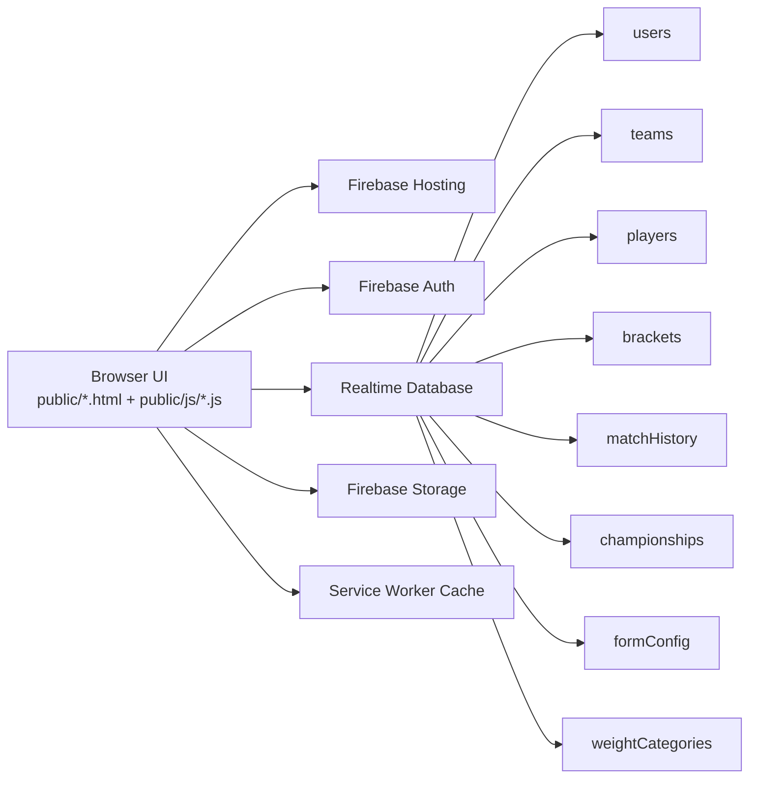

# TKD Championship Manager

<p align="center">
  <a href="https://taekowndo-championship.web.app"></a>
  
  
  
</p>

Production URL: https://taekowndo-championship.web.app

This is a complete championship operations platform built for Taekwondo events. It manages team onboarding, player registration, auto-categorization, bracket lifecycle, live match tracking, standings, and championship archival.

## Table of Contents

- [1. Project Summary](#1-project-summary)
- [2. Core Features](#2-core-features)
- [3. Role Access Matrix](#3-role-access-matrix)
- [4. Architecture](#4-architecture)
- [5. Page Map](#5-page-map)
- [6. Repository Structure](#6-repository-structure)
- [7. Client Module Map](#7-client-module-map)
- [8. Firebase Configuration](#8-firebase-configuration)
- [9. Realtime Database Model](#9-realtime-database-model)
- [10. Local Development Setup](#10-local-development-setup)
- [11. First-Time Bootstrapping](#11-first-time-bootstrapping)
- [12. Operational Workflows](#12-operational-workflows)
- [13. Deployment](#13-deployment)
- [14. Performance Notes](#14-performance-notes)
- [15. Security Notes](#15-security-notes)
- [16. Troubleshooting](#16-troubleshooting)
- [17. Roadmap Ideas](#17-roadmap-ideas)
- [18. Credits](#18-credits)

## 1. Project Summary

TKD Championship Manager is a Firebase-hosted web app for managing tournament operations from registration to final standings.

Primary capabilities:

- Multi-role login and authorization (admin, judge, team)
- Dynamic registration form configured by admin
- Automatic age and weight category derivation
- Bracket generation and round progression
- Live match status handling
- PDF and Excel export from bracket workflows
- Team-level registration deadlines and lock controls
- Championship history archive and restore

## 2. Core Features

| Area | What it does |
| --- | --- |
| Authentication | Admin/Judge use Firebase Auth email-password. Team uses username-password against `teams` node with session-based role protection. |
| Registration | Team registers players with image upload/capture and form validation. |
| Category Logic | Age category derives from DOB. Weight category derives from gender + age category + weight. |
| Brackets | Create and manage rounds, match outcomes, and progression. |
| Live Match Ops | Live and pending match views with frequent updates. |
| Standings | Championship standings and medal-oriented tracking. |
| Admin Tools | Team creation, form editor, weight category editor, championship management. |
| Export | PDF fixtures and Excel result export in bracket workflows. |
| Caching | Service worker plus runtime cache strategies for faster repeat loads. |

## 3. Role Access Matrix

| Role | Main capabilities |
| --- | --- |
| Admin | Full control: teams, form config, weight categories, championship lifecycle, bracket operations, archive/restore. |
| Judge | Match handling and bracket progression actions (as allowed by pages and rules). |
| Team | Login with team credentials, register/edit players, manage own team workflow and filters. |

## 4. Architecture



## 5. Page Map

| Route | Purpose |
| --- | --- |
| `/index.html` | Entry login page for Admin/Judge and Team tabs |
| `/register.html` | Team player registration/edit form |
| `/admin/dashboard.html` | Main admin control center |
| `/admin/bracket.html` | Tournament bracket operations |
| `/admin/Live-matches.html` | Live and up-next match board |
| `/admin/form-preview.html` | Team-facing form preview |
| `/admin/weight-categories.html` | Weight category management |
| `/admin/championships.html` | Championship CRUD manager |
| `/admin/standings.html` | Standings manager |
| `/team/dashboard.html` | Team roster dashboard, medal filter, age-category dropdown filter |

## 6. Repository Structure

```text
.
├── .firebaserc
├── firebase.json
├── firebase-rules.json
├── PERFORMANCE_OPTIMIZATIONS.md
├── README.md
├── functions/                      # currently empty
└── public/
    ├── index.html
    ├── register.html
    ├── admin/
    │   ├── dashboard.html
    │   ├── bracket.html
    │   ├── championships.html
    │   ├── form-preview.html
    │   ├── Live-matches.html
    │   ├── standings.html
    │   └── weight-categories.html
    ├── team/
    │   └── dashboard.html
    ├── assets/
    │   ├── css/main.css
    │   └── images/
    └── js/
        ├── firebase.js
        ├── auth.js
        ├── ui.js
        ├── modal.js
        ├── registration.js
        ├── bracket.js
        ├── championship-manager.js
        ├── category-logic.js
        ├── form-config.js
        ├── admin-form-editor.js
        ├── admin-category-editor.js
        ├── player-manager.js
        ├── Team-deadline-manager.js
        ├── custom-select.js
        ├── performance-cache.js
        └── service-worker.js
```

## 7. Client Module Map

| File | Responsibility |
| --- | --- |
| `public/js/firebase.js` | Firebase v11 modular initialization, global bindings, connection banner, service worker registration |
| `public/js/auth.js` | Role/session logic, admin login, team login flow, logout, redirects |
| `public/js/ui.js` | Shared UI helpers, page protection, team creation modal flow |
| `public/js/registration.js` | Dynamic form render, photo capture/upload, category calculation, submission |
| `public/js/category-logic.js` | Age and weight category functions |
| `public/js/form-config.js` | Form configuration loading/saving and defaults |
| `public/js/bracket.js` | Bracket rendering, match progression, exports |
| `public/js/championship-manager.js` | Archive, restore, create, and championship data operations |
| `public/js/player-manager.js` | Player deletion and related cleanup workflows |
| `public/js/Team-deadline-manager.js` | Team deadline and lock management |
| `public/js/service-worker.js` | App shell precache and fetch strategies |

## 8. Firebase Configuration

Firebase project alias is configured in `.firebaserc`:

```json
{
  "projects": {
    "default": "taekowndo-championship"
  }
}
```

Hosting and database config are in `firebase.json`:

- Hosting root: `public`
- Realtime Database rules file: `firebase-rules.json`
- Cache headers tuned by asset type

Important implementation detail:

- `public/js/firebase.js` initializes SDK v11 modules.
- `public/index.html` contains an inline SDK v9 bootstrap for login page flow.

When changing Firebase credentials, update both places.

## 9. Realtime Database Model

### Primary nodes

- `users`
- `teams`
- `players`
- `brackets`
- `currentMatch`
- `matchResults`
- `matchHistory`
- `championships`
- `championshipHistory`
- `championshipSettings`
- `overallStandings`
- `categoryResults`
- `weightCategories`
- `formConfig`

### Rules summary (from `firebase-rules.json`)

| Node | Read | Write |
| --- | --- | --- |
| `teams` | public | admin at root; per-team write allowed for own UID or admin |
| `users` | authenticated | currently permissive root write with per-uid conditions |
| `players` | public | currently open write |
| `formConfig` | public | admin |
| `weightCategories` | public | admin |
| `brackets` | public | admin/judge/team |
| `currentMatch` | public | admin/judge |
| `matchResults` | public | admin/judge/team |
| `matchHistory` | public | admin/judge/team |
| `championships` | public | admin (with judge write in some subpaths like standings/matches) |
| `championshipHistory` | public | admin |

## 10. Local Development Setup

### Prerequisites

- Node.js 18+
- Firebase CLI

```bash
npm install -g firebase-tools
firebase login
```

### Clone

```bash
git clone https://github.com/<your-username>/<your-repo>.git
cd "TKD Championship Manager"
```

### Attach Firebase project

```bash
firebase use --add
```

### Configure credentials

Update Firebase project config in both files:

- `public/js/firebase.js`
- `public/index.html`

### Run locally

Option 1:

```bash
firebase emulators:start --only hosting,database
```

Option 2:

```bash
firebase serve
```

Typical local URL: http://localhost:5000

## 11. First-Time Bootstrapping

Goal: create first admin who can access `/admin/dashboard.html`.

1. Create an email-password user in Firebase Authentication.
2. Copy the user UID.
3. Add admin role record in Realtime Database:

```json
{
  "users": {
    "<AUTH_UID>": {
      "role": "admin"
    }
  }
}
```

4. Login from `/index.html` using Admin/Judge tab.
5. Create team accounts from admin dashboard Team Management section.

Team creation behavior:

- Team credentials are stored in `teams/<teamId>`.
- A corresponding role record is written to `users/<teamId>` with role `team`.
- Team login is validated against `teams` credentials and session state.

## 12. Operational Workflows

### Admin workflow

1. Login as admin.
2. Configure/edit form and categories.
3. Create teams and share credentials.
4. Monitor registrations and player lists.
5. Run bracket and match operations.
6. Create new championship when cycle ends (archive and clear current active data).

### Judge workflow

1. Login as judge.
2. Open bracket and live match views.
3. Update match outcomes and progression.
4. Verify standings.

### Team workflow

1. Login using team username/password.
2. Register/edit player profiles.
3. Track roster on team dashboard.
4. Use medal and age category filters for quick review.
5. Respect deadline/lock status when registration closes.

## 13. Deployment

Deploy everything:

```bash
firebase deploy
```

Deploy only hosting:

```bash
firebase deploy --only hosting
```

Deploy only database rules:

```bash
firebase deploy --only database
```

## 14. Performance Notes

Performance improvements are documented in `PERFORMANCE_OPTIMIZATIONS.md`.

Current optimizations include:

- service worker precache and runtime strategies
- tuned cache-control headers in hosting config
- CSS and rendering optimizations
- resource preconnect/preload for critical paths

## 15. Security Notes

This project is operational and currently includes permissive rules on certain nodes for event throughput and simplicity.

Before wider public rollout, recommended hardening:

1. Restrict open writes on `players`.
2. Tighten root-level write paths in `users`.
3. Split admin/judge/team write scopes more strictly.
4. Add explicit validation rules for critical fields.

## 16. Troubleshooting

### Permission denied errors

- Confirm `users/<uid>/role` is correctly set.
- Verify `firebase-rules.json` is deployed.
- Confirm you are on the right Firebase project alias.

### Team login fails

- Check username/password in `teams` node.
- Ensure matching `users/<teamId>` role entry exists.
- Verify no accidental whitespace in credentials.

### Data looks stale

- Hard refresh browser.
- Clear service worker and site storage.
- Confirm online status in browser.

### Image upload issues

- Ensure browser camera/file permissions.
- Retry with smaller image if network is unstable.

## 17. Roadmap Ideas

- Consolidate all pages to a single Firebase SDK version.
- Add environment-driven config instead of inline credentials.
- Add automated tests for category and bracket logic.
- Add CI checks for rules and static validation.
- Add structured audit logs for critical admin actions.

## 18. Credits

- Built and developed by Chiranandan T M
- Co-supporter: Sharan B N
